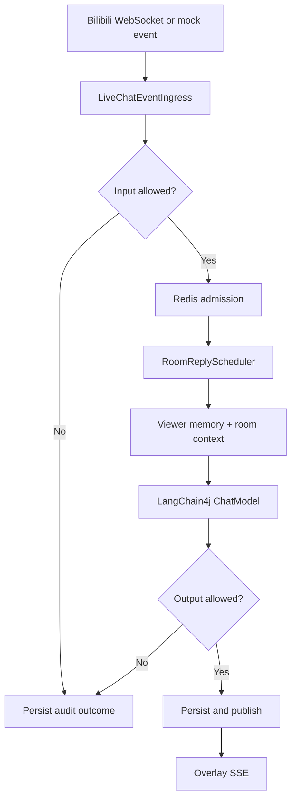
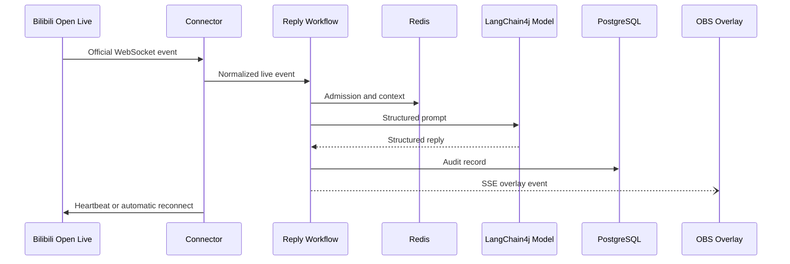

## Executive Summary

| Field | Value |
|---|---|
| Module | Java backend and React control/overlay frontend |
| Purpose | Receive official Bilibili live events, generate moderated AI replies, persist audit data, and publish an OBS overlay |
| System Role | Local-first end-to-end live interaction runtime |
| Criticality | High — connection, scheduling, model, Redis, database, and SSE paths all affect live output |
| Technology | Java 21, Spring Boot 3.5, LangChain4j 1.18.1, PostgreSQL, Redis, React, Vite |

## Technical Analysis

### Responsibilities

- Create and maintain the official Bilibili interaction session and WebSocket connection.
- Normalize live events and serialize model work per room.
- Provide viewer-specific LangChain4j memory plus shared room context.
- Apply input/output moderation, rate admission, persistence, and overlay publication.
- Expose local runtime controls, status, audience estimates, and SSE feeds.

### Key Components

| Name | Type | Purpose |
|---|---|---|
| `OfficialBilibiliLiveEventConnector` | Component | Session lifecycle, authentication, heartbeats, reconnect and event ingress |
| `ReplyWorkflowService` | Service | Moderation, admission, model orchestration, persistence and publication |
| `RoomReplyScheduler` | Component | Bounded, room-ordered model execution |
| `StreamHostAssistant` | LangChain4j AI Service | Stable AI service contract and structured reply generation |
| `RedisRoomConversationContextStore` | Store | Shared cross-viewer room context |
| `OverlayHub` / `SseHub` | Components | Local event streaming to OBS and control UI |

### Primary Execution Flow

### State and Error Handling

- PostgreSQL stores durable reply and runtime-control audit records.
- Redis stores viewer memory, room context, admission counters, and audience estimates.
- Bilibili WebSocket failures reconnect within the active session; auth timeout, silent socket, API heartbeat failure, and interaction end rebuild the session indefinitely with capped backoff.
- Model protocol selection changes only for explicit endpoint-unsupported errors; authentication, timeout, rate-limit, and server failures do not cause unsafe protocol switching.
- Overlay subscribes before loading history and periodically reconciles the control timeline, avoiding permanent event gaps.

## Module Communication

## Metrics

| Metric | Before | After | Delta | Status |
|---|---:|---:|---:|---|
| Automated tests | 74 | 78 | +4 | DONE |
| Test failures/errors | 0 | 0 | No regression | DONE |
| Frontend production vulnerabilities | Unknown | 0 | Verified | DONE |
| Permanent Bilibili session retry cutoff | 6 attempts | None; capped backoff | Removed | DONE |
| Prompt template variables | 3 | 1 stable variable | -2 | DONE |

## Referencias

- [[REFACTOR]] — Remaining bounded technical-debt recommendations.
